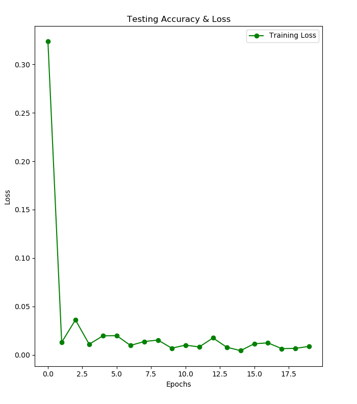

# auslan2text #
App for translating Auslan to text

## :bulb: TODO: ##
 - Look more into dynamic gesture recognition
   - LS-HAN (and Hierarchical Attention Networks in general)
   - CNNs with recurrence
   - FlowNets for optical flow? 
 - Implementations must be lightweight enough to run well on mobile devices
   - Determined by amount of memory and FLOPs required to run inference model 
   - Look into different serialization formats (possibly looking at protobufs
	 for now)
 - Create and/or look for a larger and much more diverse training set for network
  - Implement data augmentation?
 - Make prettier GUI :sweat_smile: 
 
## :mag: Research ##
Just some existing methods for gesture recognition and stuff - some are possible
candidates for implementation or for inspiration for developing different
approach.
- Video-based Sign Language Recognition without Temporal Segmentation:
  https://arxiv.org/pdf/1801.10111.pdf
- Spatial-Temporal Graph Convolutional Networks for Sign Language Recognition:
  https://arxiv.org/pdf/1901.11164.pdf
- DeepASL: 
  https://arxiv.org/pdf/1802.07584.pdf
- One-Shot detection using - uses 3D Conv but discrminatory evolution might be
  beneficial:
  https://www.researchgate.net/publication/335801178_One-shot_Learning_Hand_Gesture_Recognition_Based_on_Lightweight_3D_Convolutional_Neural_Networks_for_Portable_Applications_on_Mobile_Systems

## Arhitecture results ##

About 0.09% loss after 20 epochs (simple CNN with Batch Norm. and Max Pooling, static fingerspelling ASL).
 - Currently only works with static input, no recurrence or dynamics

